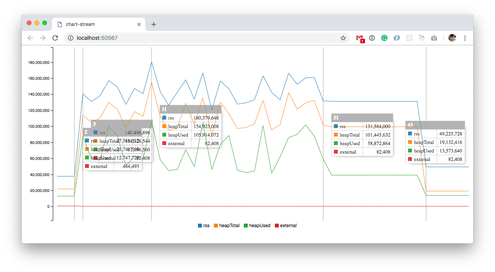

# Sentry Node SDK Memory Usage

This repo should provide a repro case + results for `@sentry/node` SDK found at: [https://github.com/getsentry/sentry-javascript/tree/master/packages/node](https://github.com/getsentry/sentry-javascript/tree/master/packages/node)

The file `express.js` in this repo was used to measure the following results.

The peak memory usage **decreased by ~80%** from version 4.5.3 → 5.x.x

Average memory usage **decreased by ~70%** from version 4.5.3 → 5.x.x

(When referring to 5.x.x I mean this work in progress branch [https://github.com/getsentry/sentry-javascript/tree/ref/make-sync](https://github.com/getsentry/sentry-javascript/tree/ref/make-sync))

## Installation + How to run:

`git clone https://github.com/HazAT/sentry-node-sdk-memory-pm.git`

`npm install`

or

`yarn install`

Then run the application with `node --inspect express.js` and open Google Chrome Memory inspection tool (can be found in the developer console).

The graphs in this repo where created with [https://github.com/watson/memory-usage](https://github.com/watson/memory-usage) used exactly as described in the repo (ran with `memory-usage express.js`)

Node version `10.15.0` was used for all the tests.

After the server is started, we run a ApacheBench command:
`ab -c 20 -n 10000 http://localhost:3000/`

Running 10000 Requests with 20 concurrent connections. 

# Using 4.5.3:

## Screenshot showing a graph of memory usage for 4.5.3

## Output ApacheBench command using 4.5.3 for a single run:

    ab -c 20 -n 10000 http://localhost:3000/
    This is ApacheBench, Version 2.3 <$Revision: 1826891 $>
    Copyright 1996 Adam Twiss, Zeus Technology Ltd, http://www.zeustech.net/
    Licensed to The Apache Software Foundation, http://www.apache.org/
    
    Benchmarking localhost (be patient)
    Completed 1000 requests
    Completed 2000 requests
    Completed 3000 requests
    Completed 4000 requests
    Completed 5000 requests
    Completed 6000 requests
    Completed 7000 requests
    Completed 8000 requests
    Completed 9000 requests
    Completed 10000 requests
    Finished 10000 requests
    
    
    Server Software:
    Server Hostname:        localhost
    Server Port:            3000
    
    Document Path:          /
    Document Length:        10 bytes
    
    Concurrency Level:      20
    Time taken for tests:   75.842 seconds
    Complete requests:      10000
    Failed requests:        0
    Non-2xx responses:      10000
    Total transferred:      1270000 bytes
    HTML transferred:       100000 bytes
    Requests per second:    131.85 [#/sec] (mean)
    Time per request:       151.684 [ms] (mean)
    Time per request:       7.584 [ms] (mean, across all concurrent requests)
    Transfer rate:          16.35 [Kbytes/sec] received
    
    Connection Times (ms)
                  min  mean[+/-sd] median   max
    Connect:        0    0   0.4      0      17
    Processing:    25  151 103.8    107     759
    Waiting:        8  126  93.7     89     714
    Total:         25  152 103.8    108     760
    
    Percentage of the requests served within a certain time (ms)
      50%    108
      66%    122
      75%    149
      80%    198
      90%    343
      95%    383
      98%    435
      99%    467
     100%    760 (longest request)

## Using 4.5.3 and run ApacheBench 3 times in total (after each GC):

# Using 5.x.x:

[https://github.com/getsentry/sentry-javascript/tree/ref/make-sync](https://github.com/getsentry/sentry-javascript/tree/ref/make-sync)

## Screenshot showing a graph of memory usage for 5.x.x

## Output ApacheBench command using 5.x.x for a single run:

    ab -c 20 -n 10000 http://localhost:3000/
    This is ApacheBench, Version 2.3 <$Revision: 1826891 $>
    Copyright 1996 Adam Twiss, Zeus Technology Ltd, http://www.zeustech.net/
    Licensed to The Apache Software Foundation, http://www.apache.org/
    
    Benchmarking localhost (be patient)
    Completed 1000 requests
    Completed 2000 requests
    Completed 3000 requests
    Completed 4000 requests
    Completed 5000 requests
    Completed 6000 requests
    Completed 7000 requests
    Completed 8000 requests
    Completed 9000 requests
    Completed 10000 requests
    Finished 10000 requests
    
    
    Server Software:
    Server Hostname:        localhost
    Server Port:            3000
    
    Document Path:          /
    Document Length:        10 bytes
    
    Concurrency Level:      20
    Time taken for tests:   58.991 seconds
    Complete requests:      10000
    Failed requests:        0
    Non-2xx responses:      10000
    Total transferred:      1270000 bytes
    HTML transferred:       100000 bytes
    Requests per second:    169.52 [#/sec] (mean)
    Time per request:       117.983 [ms] (mean)
    Time per request:       5.899 [ms] (mean, across all concurrent requests)
    Transfer rate:          21.02 [Kbytes/sec] received
    
    Connection Times (ms)
                  min  mean[+/-sd] median   max
    Connect:        0    0   0.3      0      12
    Processing:    32  117  26.3    119     262
    Waiting:       12   99  23.1    100     231
    Total:         32  118  26.2    119     262
    
    Percentage of the requests served within a certain time (ms)
      50%    119
      66%    128
      75%    134
      80%    138
      90%    148
      95%    158
      98%    169
      99%    183
     100%    262 (longest request)

## Using 5.x.x and run ApacheBench 3 times in total (after each GC):

